# 性能分析


## 安装prometheus-stack

首先到https://github.com/prometheus-operator/kube-prometheus确定兼容当前kubenetes版本的分支，本例中，适配1.23的分支是0.10

克隆匹配的分支

```bash
git clone -b release-0.10 https://github.com/prometheus-operator/kube-prometheus.git

cd kube-prometheus
```


安装Prometheus Operator

```bash
kubectl apply --server-side -f manifests/setup

kubectl apply -f manifests/
```


查看注册的CRD

```bash
kubectl get crd | grep monitoring
```


查看相关的api资源

```bash
kubectl api-resources | grep monitoring
```


查看容器状态

```bash
kubectl get pod -n monitoring
```


查看svc

```bash
kubectl get svc -n monitoring
```


将prometheus-k8s的端口映射到nodeport 30110

```bash
kubectl patch svc -n monitoring prometheus-k8s  -p '{"spec":{"type": "NodePort"}}'
kubectl patch service prometheus-k8s --namespace=monitoring --type='json' --patch='[{"op": "replace", "path": "/spec/ports/0/nodePort", "value":30110}]'
```


将grafana的端口映射到nodeport 30120

```bash
kubectl patch svc -n monitoring grafana  -p '{"spec":{"type": "NodePort"}}'
kubectl patch service grafana --namespace=monitoring --type='json' --patch='[{"op": "replace", "path": "/spec/ports/0/nodePort", "value":30120}]'
```


将alertmanager的端口映射到nodeport 30130

```bash
kubectl patch svc -n monitoring alertmanager-main  -p '{"spec":{"type": "NodePort"}}'
kubectl patch service alertmanager-main --namespace=monitoring --type='json' --patch='[{"op": "replace", "path": "/spec/ports/0/nodePort", "value":30130}]'
```


**备注**
修改alertmanager副本数（如果不需要高可用性，可以将replicas修改为1）

```bash
nano manifests/alertmanager-alertmanager.yaml
```

kubectl apply -f alertmanager-alertmanager.yaml


修改prometheus副本数（如果不需要高可用性，可以将replicas修改为1）

```bash
nano manifests/prometheus-prometheus.yaml
```

kubectl apply -f prometheus-prometheus.yaml


修改kubeStateMetrics-deployment.yaml中的映像地址（国内版需要）

```bash
nano kubeStateMetrics-deployment.yaml  
```


将k8s.gcr.io/kube-state-metrics/kube-state-metrics:v2.3.0替换为bitnami/kube-state-metrics:2.3.0

kubectl apply -f prometheus-prometheus.yaml


如果使用lens，在metric配置页面中选择Prometheus Operator monitoring/prometheus-k8s:9090


推荐dashboard

- 315
- 1860：Node Exporter Full

- 13105：K8S Prometheus Dashboard 20211010 中文版

- 11074： Node Exporter for Prometheus Dashboard EN 20201010

- 12633：


## Exporter监控模式分析


解析export监控模式

```bash
netstat -lantup
```


查看node exporter

```bash
ps aux | grep node
```


查看9100端口的通信

```bash
netstat -lntp | grep 9100
```


收集本地metric信息

```bash
curl 127.0.0.1:9100/metrics
```


解析metric监控模式

```bash
netstat -lntp | grep kube-proxy
```


```bash
curl http://127.0.0.1:10249/metrics
```


查看servicemonitor对象

```bash
kubectl get servicemonitor -n monitoring
```


查看node-exporter配置

```bash
kubectl get servicemonitor -n monitoring node-exporter -o yaml
```


查看node-exporter servicemonitor对应的服务

```bash
kubectl get svc -n monitoring -l app.kubernetes.io/name=node-exporter
```


查看node-exporter对应的端点

```bash
kubectl get ep node-exporter -n monitoring
```


加载 dashboard 14513：Linux Exporter Node查看分析效果


## ETCD的监控

查看etcd的端口

```bash
netstat -lntp | grep etcd
```


尝试访问etcd的metric接口

```bash
curl 192.168.1.231:2379/metrics
```


```bash
curl https://192.168.1.231:2379/metrics
```

分别看到52和60报错


查看etcd证书信息

```bash
grep -E "key-file|cert-file" /etc/kubernetes/manifests/etcd.yaml
```


再次访问etcd的metric接口

```bash
curl -s --cert /etc/kubernetes/pki/etcd/server.crt --key /etc/kubernetes/pki/etcd/server.key https://192.168.1.231:2379/metrics -k
```


```bash
curl -s --cert /etc/kubernetes/pki/etcd/server.crt --key /etc/kubernetes/pki/etcd/server.key https://192.168.1.231:2379/metrics -k | tail -1
```


创建etcd 服务

```bash
nano  etcd-svc.yaml
```

```yaml
apiVersion: v1
kind: Endpoints
metadata:
  labels:
    app: etcd-prom
  name: etcd-prom
  namespace: kube-system
subsets:
- addresses: 
  - ip: 192.168.1.231 #etcd服务器ip地址
  ports:
  - name: https-metrics
    port: 2379   # etcd端口
    protocol: TCP
---
apiVersion: v1
kind: Service 
metadata:
  labels:
    app: etcd-prom
  name: etcd-prom
  namespace: kube-system
spec:
  ports:
  - name: https-metrics
    port: 2379
    protocol: TCP
    targetPort: 2379
  type: ClusterIP
```


创建服务

```bash
kubectl apply -f etcd-svc.yaml
```


查看etcd服务信息

```bash
kubectl get svc -A | grep etcd
```

  观察服务的ip地址


使用上述etcd服务地址访问metric信息

```bash
curl -s --cert /etc/kubernetes/pki/etcd/server.crt --key /etc/kubernetes/pki/etcd/server.key https://10.99.164.210:2379/metrics -k | tail -1
```


创建secret

```bash
kubectl -n monitoring create secret generic etcd-certs --from-file=/etc/kubernetes/pki/etcd/healthcheck-client.crt --from-file=/etc/kubernetes/pki/etcd/healthcheck-client.key --from-file=/etc/kubernetes/pki/etcd/ca.crt
```


查看secret 

```bash
kubectl get secret -n monitoring | grep etcd
```


修改promethus定义，增加certs信息

```bash
KUBE_EDITOR="nano"  kubectl edit prometheus k8s -n monitoring
```

  

```
  replicas: 1
  secrets: #加在此处
  - etcd-certs
```


查看Prometheus Pod更新过程

```bash
kubectl get pod -n monitoring | grep k8s
```


查看etcd证书注入信息

```bash
kubectl exec -n  monitoring prometheus-k8s-0  -c prometheus -- ls /etc/prometheus/secrets/etcd-certs
```


创建service monitor配置

```bash
nano servicemonitor.yaml
```


```yaml
apiVersion: monitoring.coreos.com/v1
kind: ServiceMonitor
metadata:
  name: etcd
  namespace: monitoring
  labels:
    app: etcd
spec:
  jobLabel: k8s-app
  endpoints:
    - interval: 30s
      port: https-metrics  # 这个port对应 Service.spec.ports.name
      scheme: https
      tlsConfig:
        caFile: /etc/prometheus/secrets/etcd-certs/ca.crt
        certFile: /etc/prometheus/secrets/etcd-certs/healthcheck-client.crt
        keyFile: /etc/prometheus/secrets/etcd-certs/healthcheck-client.key
        insecureSkipVerify: true  # 关闭证书校验
  selector:
    matchLabels:
      app: etcd-prom  # 跟Service的lables保持一致
  namespaceSelector:
    matchNames:
    - kube-system
```


```bash
kubectl apply -f servicemonitor.yaml
```


查看servicemonitor是否被正常加载

```bash
kubectl get servicemonitor -n monitoring
```


从Prometheus status-->configuration http://node1:30110/config 页面上检查etcd配置项


从Prometheus status-->targets 页面上检查etcd配置项


从Prometheus status-->service discovery 页面上检查etcd配置项


从Prometheus 首页尝试使用etcd相关指标进行查看


加载3070 dashboard在grafana中查看etcd相关数据


## 配置MySQL-Exporter

创建MySLQ样例

```bash
kubectl create deploy mysql --image=registry.cn-beijing.aliyuncs.com/dotbalo/mysql:5.7.23
```


查看pod状态

```bash
kubectl get pod
```


获取pod log

```bash
kubectl logs mysql-686695c696-9cfld
```


设置MySQL根密码

```bash
kubectl set env deploy/mysql MYSQL_ROOT_PASSWORD=mysql
```


再次查看pod状态

```bash
kubectl get pod
```


创建服务

```bash
kubectl expose deploy mysql --port 3306
```


查看服务

```bash
kubectl get svc
```


```bash
kubectl get svc -l app=mysql
```


设置exporter所需凭据

```bash
kubectl get pod
```


```bash
kubectl exec -ti mysql-69d6f69557-5vnvg -- bash
```


```bash
mysql -uroot -pmysql
```


```sql
CREATE USER 'exporter'@'%' IDENTIFIED BY 'exporter' WITH MAX_USER_CONNECTIONS 3;

GRANT PROCESS, REPLICATION CLIENT, SELECT ON *.* TO 'exporter'@'%';
```


```bash
quit

exit
```


创建exporter

```bash
nano mysql-exporter.yaml
```

```yaml
---
apiVersion: apps/v1
kind: Deployment
metadata:
  name: mysql-exporter
  namespace: monitoring
spec:
  replicas: 1
  selector:
    matchLabels:
      k8s-app: mysql-exporter
  template:
    metadata:
      labels:
        k8s-app: mysql-exporter
    spec:
      containers:
      - name: mysql-exporter
        image: registry.cn-beijing.aliyuncs.com/dotbalo/mysqld-exporter 
        env:
         - name: DATA_SOURCE_NAME
           value: "exporter:exporter@(mysql.default:3306)/"
        imagePullPolicy: IfNotPresent
        ports:
        - containerPort: 9104
---
apiVersion: v1
kind: Service
metadata:
  name: mysql-exporter
  namespace: monitoring
  labels:
    k8s-app: mysql-exporter
spec:
  type: ClusterIP
  selector:
    k8s-app: mysql-exporter
  ports:
  - name: api
    port: 9104
    protocol: TCP
```

```bash
kubectl apply -f mysql-exporter.yaml
```


验证exporter的运行情况

```bash
kubectl get pod -n monitoring

kubectl get svc -n monitoring
```


```bash
curl 10.98.190.181:9104/metrics
```


创建ServiceMonitor

```bash
nano mysql-sm.yaml
```

```yaml
apiVersion: monitoring.coreos.com/v1
kind: ServiceMonitor
metadata:
  name: mysql-exporter
  namespace: monitoring
  labels:
    k8s-app: mysql-exporter
    namespace: monitoring
spec:
  jobLabel: k8s-app
  endpoints:
  - port: api
    interval: 30s
    scheme: http
  selector:
    matchLabels:
      k8s-app: mysql-exporter
  namespaceSelector:
    matchNames:
    - monitoring
```

```bash
kubectl apply -f mysql-sm.yaml
```


验证ServiceMonitor

```bash
kubectl get servicemonitor -n monitoring
```


检查配置
从Prometheus status-->configuration 页面上检查MySQL配置项

从Prometheus status-->targets 页面上检查MySQL配置项

从Prometheus status-->service discovery 页面上检查MySQL配置项

从Prometheus 首页尝试使用MySQL相关指标进行查看

加载7362 6239 17320 14057 dashboard在grafana中查看MySQL相关数据


实验性项目，多个MySQL实例的监控
https://blog.csdn.net/weixin_44932410/article/details/125029852

后续可以参照
https://github.com/prometheus/mysqld_exporter

kubectl create ns blog

kubectl apply -f https://raw.githubusercontent.com/cloudzun/k8slab/v1.23/storage/mysql.deploy.yaml

kubectl create ns blog

kubectl exec -ti mysql-deploy-cd587bcb4-hgt68 -n blog  -- bash

mysql -uroot -pwordpress


CREATE USER 'exporter'@'%' IDENTIFIED BY 'exporter' WITH MAX_USER_CONNECTIONS 3;

GRANT PROCESS, REPLICATION CLIENT, SELECT ON *.* TO 'exporter'@'%';

quit

exit

nano mysql-exporter.yaml

        env:
         - name: DATA_SOURCE_NAME
           value: "exporter:exporter@(mysql.default:3306)/"
           value: "exporter:exporter@(mysql.blog.svc.cluster.local:3306)/" #增加监控对象


## 黑盒监控

检查黑blackbox-exporter配置

```bash
kubectl get pod -n monitoring -l app.kubernetes.io/name=blackbox-exporter

kubectl get svc -n monitoring -l app.kubernetes.io/name=blackbox-exporter
```


使用blackbox监控网站

```bash
curl -s "http://10.106.61.226:19115/probe?target=cloudzun.com&module=http_2xx" | tail -l 
```


检查blackbox配置

```bash
kubectl get cm blackbox-exporter-configuration   -n  monitoring -o yaml
```


## 静态配置

### 监控web url

创建静态配置

```bash
touch prometheus-additional.yaml
```


创建对应的secret并查看

```bash
kubectl create secret generic additional-configs --from-file=prometheus-additional.yaml -n monitoring
```


```bash
kubectl get secret additional-configs   -n monitoring

kubectl describe secret additional-configs -n monitoring
```


修改promethus定义，增加additionalScrapeConfigs信息

```bash
KUBE_EDITOR="nano"  kubectl edit prometheus k8s -n monitoring
```

  

```yaml
image: quay.io/prometheus/prometheus:v2.32.1
  additionalScrapeConfigs:
    key: prometheus-additional.yaml
    name: additional-configs
    optional: true
```


更新静态配置文件

```bash
nano prometheus-additional.yaml
```

```yaml
- job_name: 'blackbox'
  metrics_path: /probe
  params:
    module: [http_2xx] # Look for a HTTP 200 response.
  static_configs:
    - targets:
      - http://cloudzun.com # Target to probe with http.
      - https://www.google.com # Target to probe with https.      
      - https://chengzhweb1030.azurewebsites.net/
  relabel_configs:
    - source_labels: [__address__]
      target_label: __param_target
    - source_labels: [__param_target]
      target_label: instance
    - target_label: __address__
      replacement: 10.106.61.226:19115 # The blackbox exporter's real hostname:port.需要写IP地址
```


热更新secret文件

```bash
kubectl create secret generic additional-configs --from-file=prometheus-additional.yaml --dry-run=client -o yaml | kubectl replace -f - -n monitoring
```


检查配置
从Prometheus status-->configuration 页面上检查blackbox配置项

从Prometheus status-->targets 页面上检查blackbox配置项

从Prometheus status-->service discovery 页面上检查blackbox配置项

从Prometheus 首页尝试使用blackbox相关指标进行查看

加载13659 7587 dashboard在grafana中查看blackbox相关数据


### 监控Windows Exporter

下载安装Windows Exporter

https://github.com/prometheus-community/windows_exporter/releases


查看本地的metrics输出信息
http://192.168.1.6:9182/metrics


更新静态配置文件

```bash
nano prometheus-additional.yaml
```

```yaml
- job_name: 'WindowsServerMonitor'
  static_configs:
    - targets:
      - "192.168.1.6:9182"
      labels:
        server_type: 'windows'
  relabel_configs:
    - source_labels: [__address__]
      target_label: instance
```


热更新secret文件

```bash
kubectl create secret generic additional-configs --from-file=prometheus-additional.yaml --dry-run=client -o yaml | kubectl replace -f - -n monitoring
```


检查配置
从Prometheus status-->configuration 页面上检查Windows配置项

从Prometheus status-->targets 页面上检查Windows配置项

从Prometheus status-->service discovery 页面上检查Windows配置项

从Prometheus 首页尝试使用Windows相关指标进行查看

加载10467  15453 dashboard在grafana中查看Windows相关数据


## 启用AlertManger

*编辑 alertmanager-secret.yaml

```bash
cd kube-prometheus/manifests/
```

```bash
nano alertmanager-secret.yaml
```

```yaml
apiVersion: v1
kind: Secret
metadata:
  labels:
    app.kubernetes.io/component: alert-router
    app.kubernetes.io/instance: main
    app.kubernetes.io/name: alertmanager
    app.kubernetes.io/part-of: kube-prometheus
    app.kubernetes.io/version: 0.23.0
  name: alertmanager-main
  namespace: monitoring
stringData:
  alertmanager.yaml: |-
    "global":
      "resolve_timeout": "5m"
      smtp_from: "simaaofu@163.com"
      smtp_smarthost: "smtp.163.com:465"
      smtp_auth_username: "simaaofu@163.com"
      smtp_auth_password: "SMTPAUTHPASSWORD"
      smtp_require_tls: false
      smtp_hello: "163.com"
    "inhibit_rules":
    - "equal":
      - "namespace"
      - "alertname"
      "source_matchers":
      - "severity = critical"
      "target_matchers":
      - "severity =~ warning|info"
    - "equal":
      - "namespace"
      - "alertname"
      "source_matchers":
      - "severity = warning"
      "target_matchers":
      - "severity = info"
    "receivers":
    - "name": "Default"
      email_configs:
      - to : "simaaofu@163.com"
        send_resolved: true
    - "name": "Watchdog"
      email_configs:
      - to : "chengzunhua@msn.com"
        send_resolved: true
    - "name": "Critical"
      email_configs:
      - to : "chengzunhua@msn.com"
        send_resolved: true
    "route":
      "group_by":
      - "namespace"
      - "job"
      - "alertname"
      "group_interval": "5m"
      "group_wait": "30s"
      "receiver": "Default"
      "repeat_interval": "12h"
      "routes":
      - "matchers":
        - "alertname = Watchdog"
        "receiver": "Watchdog"
      - "matchers":
        - "severity = critical"
        "receiver": "Critical"
type: Opaque
```


更新配置

```bash
kubectl apply -f  alertmanager-secret.yaml
```


在alertmanager界面查看更新的报警组


在alertmanager status界面查看更新的config


查看prometheusrule

```bash
kubectl get prometheusrule -n monitoring
```


查看node-exporter对应的prometheusrule

```bash
kubectl get prometheusrule node-exporter-rules -n monitoring -o yaml
```


创建web网站报警配置

```bash
nano  web-rule.yaml
```

```yaml
apiVersion: monitoring.coreos.com/v1
kind: PrometheusRule
metadata:
  labels:
    app.kubernetes.io/component: exporter
    app.kubernetes.io/name: blackbox-exporter
    prometheus: k8s
    role: alert-rules
  name: blackbox
  namespace: monitoring
spec:
  groups:
  - name: blackbox-exporter
    rules:
    - alert: DomainAccessDelayExceeds1s
      annotations:
        description:  域名 {{ $labels.instance }} 检测延迟大于1秒, 当前值为 {{ $value }}
        summary: 域名探测，访问延迟超过1秒
      expr: sum(probe_http_duration_seconds{job=~"blackbox"}) by (instance) > 1
      for: 1m
      labels:
        severity: warning
        type: blackbox
```

```bash
kubectl apply -f web-rule.yaml
```


到邮箱查看告警邮件

# 事件收集日志分析


## 实现Elasticsearch+filebeat+Kibana Stack


### 部署块存储方案 

安装longhorn

```bash
kubectl apply -f https://raw.githubusercontent.com/longhorn/longhorn/v1.2.4/deploy/longhorn.yaml
```


将longhorn设置为默认存储类

````bash
kubectl patch storageclass longhorn -p '{"metadata": {"annotations":{"storageclass.kubernetes.io/is-default-class":"true"}}}'
````


确认存储类型

```bash
kubectl get sc
```


```bash
root@node1:~# kubectl get sc
NAME                 PROVISIONER          RECLAIMPOLICY   VOLUMEBINDINGMODE   ALLOWVOLUMEEXPANSION   AGE
longhorn (default)   driver.longhorn.io   Delete          Immediate           true                   4h13m

```


检查longhorn安装情况

```bash
kubectl get pod -n longhorn-system
```

```bash
root@node1:~# kubectl get pod -n longhorn-system
NAME                                        READY   STATUS    RESTARTS       AGE
csi-attacher-6454556647-cw4jc               1/1     Running   0              4h8m
csi-attacher-6454556647-gvjk8               1/1     Running   0              4h8m
csi-attacher-6454556647-vc7ws               1/1     Running   0              4h8m
csi-provisioner-869bdc4b79-r5v8j            1/1     Running   0              4h8m
csi-provisioner-869bdc4b79-rn9zp            1/1     Running   0              4h8m
csi-provisioner-869bdc4b79-v7kc9            1/1     Running   0              4h8m
csi-resizer-6d8cf5f99f-69kdl                1/1     Running   0              4h8m
csi-resizer-6d8cf5f99f-vwn4c                1/1     Running   0              4h8m
csi-resizer-6d8cf5f99f-xlcws                1/1     Running   0              4h8m
csi-snapshotter-588457fcdf-77h4k            1/1     Running   0              4h8m
csi-snapshotter-588457fcdf-fpkjf            1/1     Running   0              4h8m
csi-snapshotter-588457fcdf-jxdrs            1/1     Running   0              4h8m
engine-image-ei-4dbdb778-58sx7              1/1     Running   0              4h9m
engine-image-ei-4dbdb778-9c6mr              1/1     Running   0              4h9m
engine-image-ei-4dbdb778-csgdl              1/1     Running   0              4h9m
instance-manager-e-46afa502                 1/1     Running   0              4h9m
instance-manager-e-d020b8c8                 1/1     Running   0              4h9m
instance-manager-e-f8a6153d                 1/1     Running   0              4h9m
instance-manager-r-263a334e                 1/1     Running   0              4h8m
instance-manager-r-85b971e6                 1/1     Running   0              4h8m
instance-manager-r-a4c3d8b4                 1/1     Running   0              4h9m
longhorn-csi-plugin-hv8qf                   2/2     Running   0              4h8m
longhorn-csi-plugin-jm7kv                   2/2     Running   0              4h8m
longhorn-csi-plugin-t9z4k                   2/2     Running   0              4h8m
longhorn-driver-deployer-7c85dc8c69-wlsf6   1/1     Running   0              4h9m
longhorn-manager-h88kx                      1/1     Running   1 (4h9m ago)   4h9m
longhorn-manager-zf945                      1/1     Running   0              4h9m
longhorn-manager-zwjpw                      1/1     Running   0              4h9m
longhorn-ui-6dcd69998-9rscr                 1/1     Running   0              4h9m
```

```bash
kubectl get svc -n longhorn-system
```

```
root@node1:~# kubectl get svc -n longhorn-system
NAME                       TYPE        CLUSTER-IP       EXTERNAL-IP   PORT(S)        AGE
csi-attacher               ClusterIP   10.105.33.144    <none>        12345/TCP      4h9m
csi-provisioner            ClusterIP   10.106.35.240    <none>        12345/TCP      4h9m
csi-resizer                ClusterIP   10.101.232.11    <none>        12345/TCP      4h9m
csi-snapshotter            ClusterIP   10.107.169.238   <none>        12345/TCP      4h9m
longhorn-backend           ClusterIP   10.100.136.167   <none>        9500/TCP       4h11m
longhorn-engine-manager    ClusterIP   None             <none>        <none>         4h11m
longhorn-frontend          NodePort    10.97.31.129     <none>        80:30210/TCP   4h11m
longhorn-replica-manager   ClusterIP   None             <none>        <none>         4h11m
```


将longhorn UI发布到nodeport 30210

```bash
kubectl patch svc -n longhorn-system longhorn-frontend  -p '{"spec":{"type": "NodePort"}}'
kubectl patch service longhorn-frontend --namespace=longhorn-system --type='json' --patch='[{"op": "replace", "path": "/spec/ports/0/nodePort", "value":30210}]'
```


### 部署EFK Stack

下载Helm仓库源码

```bash
wget -O helm-charts.tgz  https://github.com/elastic/helm-charts/archive/7.9.2.tar.gz
tar -zxvf helm-charts.tgz
cd helm-charts-7.9.2
```


国内替代方案

```bash
wget -O helm-charts.tgz  https://github.com/elastic/helm-charts/archive/7.9.2.tar.gz
tar -zxvf helm-charts.tgz
cd helm-charts-7.9.2
```


更改elasticsearch副本数，此处选用最低副本数

```bash
nano elasticsearch/values.yaml
```

```yaml
# Elasticsearch roles that will be applied to this nodeGroup
# These will be set as environment variables. E.g. node.master=true
roles:
  master: "true"
  ingest: "true"
  data: "true"

replicas: 1 # 将副本数量设置为1,下一行相同
minimumMasterNodes: 1

esMajorVersion: ""

# Allows you to add any config files in /usr/share/elasticsearch/config/
# such as elasticsearch.yml and log4j2.properties
esConfig: {}
#  elasticsearch.yml: |
#    key:
#      nestedkey: value
#  log4j2.properties: |
#    key = value
```


安装elasticsearch

```bash
helm install es --namespace=efk ./elasticsearch
```


修改 filebeat api version

```bash
nano filebeat/templates/clusterrole.yaml
```


```yaml
{{- if .Values.managedServiceAccount }}
apiVersion: rbac.authorization.k8s.io/v1 # 将此处版本修改为当前设置
kind: ClusterRole
metadata:
  name: {{ template "filebeat.serviceAccount" . }}-cluster-role
  labels:
    app: "{{ template "filebeat.fullname" . }}"
    chart: "{{ .Chart.Name }}-{{ .Chart.Version }}"
    heritage: {{ .Release.Service | quote }}
    release: {{ .Release.Name | quote }}
rules:
- apiGroups:
  - ""
  resources:
  - namespaces
  - nodes
  - pods
  verbs:
  - get
  - list
  - watch
{{- end -}}
```


```bash
nano filebeat/templates/clusterrolebinding.yaml 
```


```yaml
{{- if .Values.managedServiceAccount }}
apiVersion: rbac.authorization.k8s.io/v1 # 将此处版本修改为当前设置
kind: ClusterRoleBinding
metadata:
  name: {{ template "filebeat.serviceAccount" . }}-cluster-role-binding
  labels:
    app: "{{ template "filebeat.fullname" . }}"
    chart: "{{ .Chart.Name }}-{{ .Chart.Version }}"
    heritage: {{ .Release.Service | quote }}
    release: {{ .Release.Name | quote }}
roleRef:
  kind: ClusterRole
  name: {{ template "filebeat.serviceAccount" . }}-cluster-role
  apiGroup: rbac.authorization.k8s.io
subjects:
- kind: ServiceAccount
  name: {{ template "filebeat.serviceAccount" . }}
  namespace: {{ .Release.Namespace }}
{{- end -}}
```


安装filebeat

```bash
helm install fb --namespace=efk ./filebeat
```


安装kibana

```bash
helm install kb --namespace=efk ./kibana
```


查看elasticsearch所对应的pv和pvc

```bash
kubectl get pvc -n efk
```


```
root@node1:~# kubectl get pvc -n efk
NAME                                          STATUS   VOLUME                                     CAPACITY   ACCESS MODES   STORAGECLASS   AGE
elasticsearch-master-elasticsearch-master-0   Bound    pvc-d6243ec6-f4cf-4ea5-9286-60a335cc2518   30Gi       RWO            longhorn       4h6m
```


```bash
kubectl get pv
```


```
root@node1:~# kubectl get pv
NAME                                       CAPACITY   ACCESS MODES   RECLAIM POLICY   STATUS   CLAIM                                             STORAGECLASS   REASON   AGE
pvc-d6243ec6-f4cf-4ea5-9286-60a335cc2518   30Gi       RWO            Delete           Bound    efk/elasticsearch-master-elasticsearch-master-0   longhorn                4h6m

```


通过longhorn页面查看pv和pvc信息

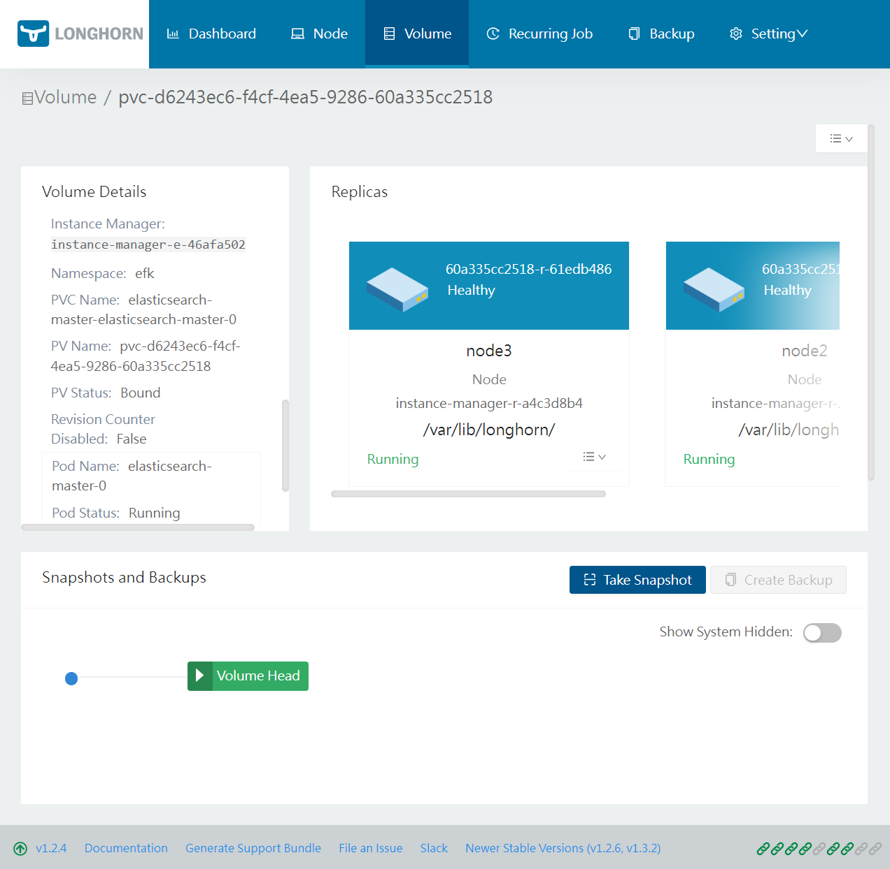


查看pod和svc

```bash
kubectl get pod -n efk
```


```
root@node1:~/helm-charts-7.9.2# kubectl get pod -n efk
NAME                         READY   STATUS    RESTARTS   AGE
elasticsearch-master-0       1/1     Running   0          3h55m
fb-filebeat-2t78k            1/1     Running   0          3h52m
fb-filebeat-l5chq            1/1     Running   0          3h52m
fb-filebeat-pjsd6            1/1     Running   0          3h52m
kb-kibana-76c88c8965-lfdm5   1/1     Running   0          3h51m
```


```bash
kubectl get svc -n efk
```


```
root@node1:~/helm-charts-7.9.2# kubectl get svc -n efk
NAME                            TYPE        CLUSTER-IP       EXTERNAL-IP   PORT(S)             AGE
elasticsearch-master            ClusterIP   10.101.66.117    <none>        9200/TCP,9300/TCP   3h56m
elasticsearch-master-headless   ClusterIP   None             <none>        9200/TCP,9300/TCP   3h56m
kb-kibana                       NodePort    10.103.185.165   <none>        5601:30140/TCP      3h52m
```


为kibana服务开放nodeport 30140端口

```bash
kubectl patch svc -n efk kb-kibana  -p '{"spec":{"type": "NodePort"}}'
kubectl patch service kb-kibana --namespace=efk --type='json' --patch='[{"op": "replace", "path": "/spec/ports/0/nodePort", "value":30140}]'
```


使用30140端口打开kibana界面进行初始化

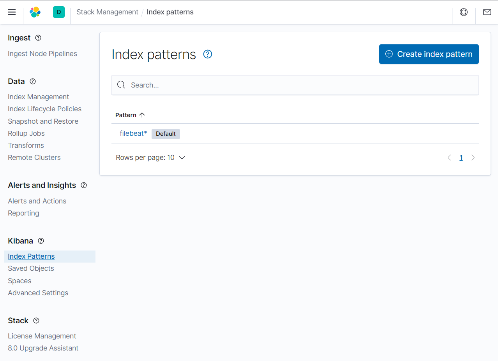


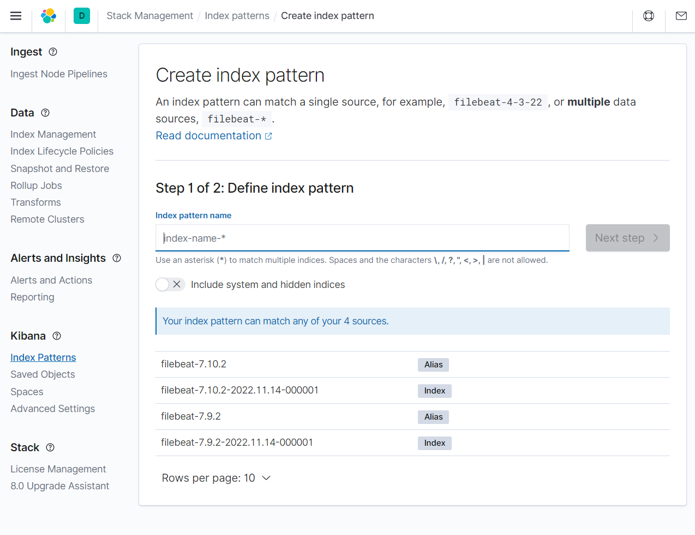


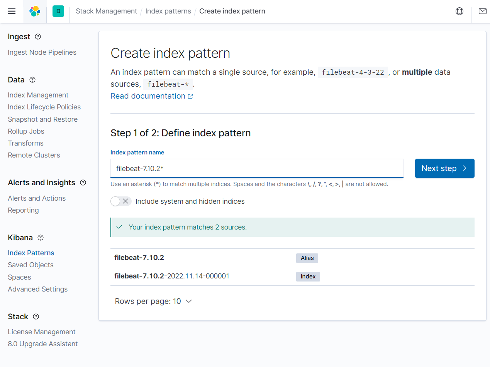

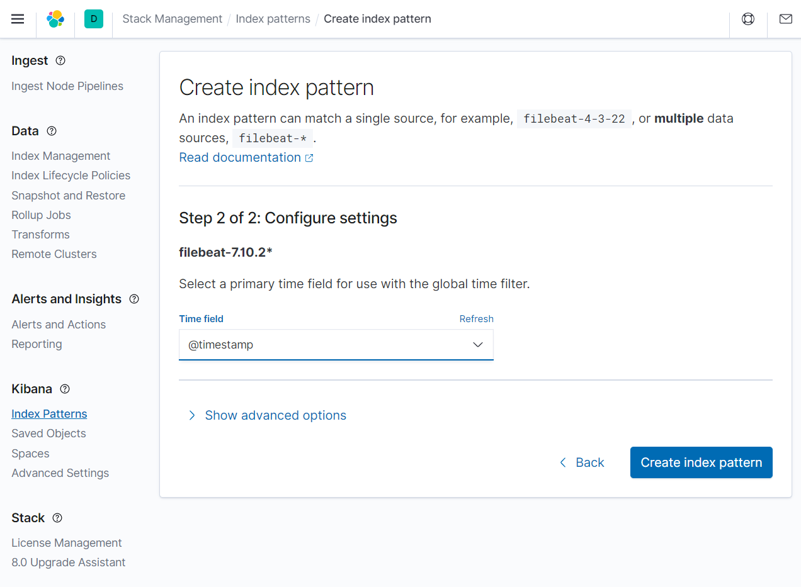


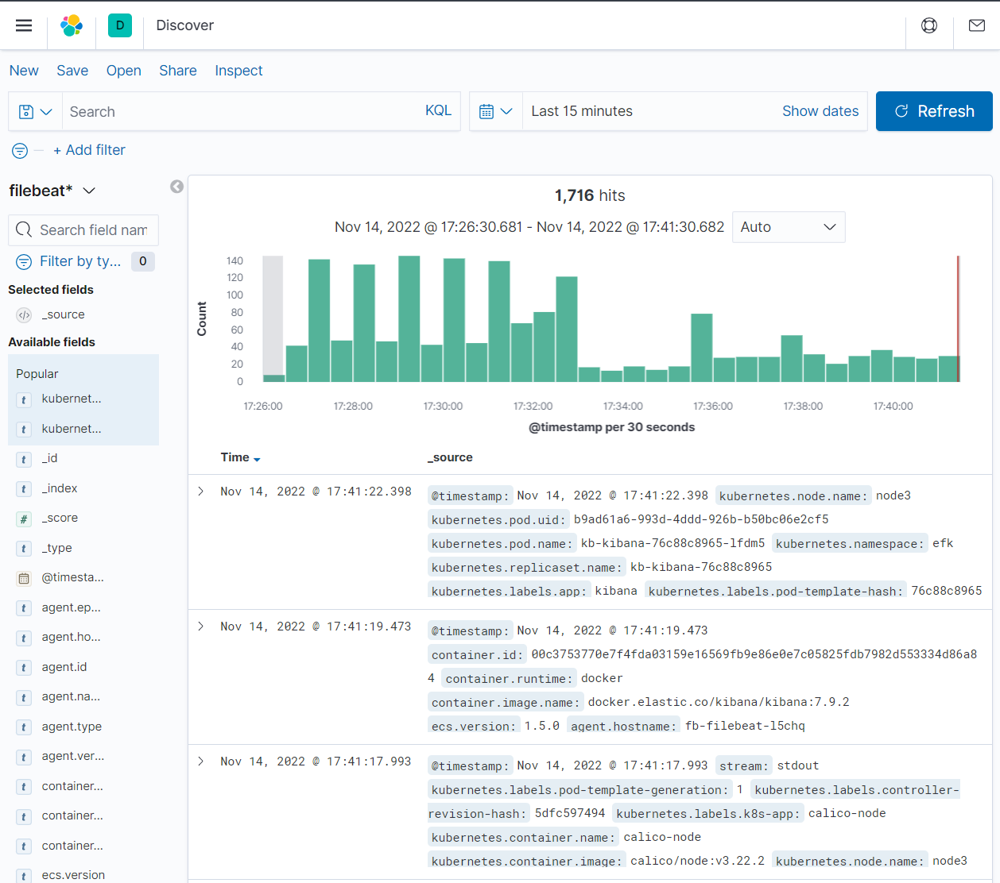


## Filebeat注入实验

查看命名空间 efk 中的 pod

```
 kubectl get pod -n efk
```


```
root@node1:~# kubectl get pod -n efk
NAME                         READY   STATUS    RESTARTS   AGE
elasticsearch-master-0       1/1     Running   0          4h23m
fb-filebeat-2t78k            1/1     Running   0          4h20m
fb-filebeat-l5chq            1/1     Running   0          4h20m
fb-filebeat-pjsd6            1/1     Running   0          4h20m
kb-kibana-76c88c8965-lfdm5   1/1     Running   0          4h18m
```


查看其中某个pod的日志

```
kubectl logs fb-filebeat-pjsd6  -n efk
```


```
2022-11-14T09:52:41.662Z        INFO    [monitoring]    log/log.go:145  Non-zero metrics in the last 30s        {"monitoring": {"metrics": {"beat":{"cpu":{"system":{"ticks":30140,"time":{"ms":68}},"total":{"ticks":68100,"time":{"ms":93},"value":68100},"user":{"ticks":37960,"time":{"ms":25}}},"handles":{"limit":{"hard":1048576,"soft":1048576},"open":20},"info":{"ephemeral_id":"6e1622b9-df49-421e-b048-0913fba358bd","uptime":{"ms":15660093}},"memstats":{"gc_next":25772688,"memory_alloc":14153344,"memory_total":4278960264},"runtime":{"goroutines":75}},"filebeat":{"events":{"added":68,"done":68},"harvester":{"closed":1,"files":{"394097ab-8b7c-4191-bf7e-bbc1fe38991b":{"last_event_published_time":"2022-11-14T09:52:18.596Z","last_event_timestamp":"2022-11-14T09:52:18.010Z","read_offset":2488,"size":2488},"3a32633d-f952-4acd-a76e-bf04e7e5c00a":{"last_event_published_time":"2022-11-14T09:52:28.958Z","last_event_timestamp":"2022-11-14T09:52:28.622Z","read_offset":2425,"size":1816},"52ba1ebd-1ab6-43ec-b84a-98a55936fbb6":{"last_event_published_time":"2022-11-14T09:52:23.058Z","last_event_timestamp":"2022-11-14T09:52:16.802Z","read_offset":1515},"62895648-a424-412c-94eb-2d5a226d0efd":{"last_event_published_time":"2022-11-14T09:52:33.571Z","last_event_timestamp":"2022-11-14T09:52:32.247Z","read_offset":8606,"size":11561},"f00deb2a-beba-447b-bfbb-7aff831ff0e6":{"last_event_published_time":"2022-11-14T09:52:23.642Z","last_event_timestamp":"2022-11-14T09:52:16.562Z","name":"/var/log/containers/hello-27806992-59lcm_default_hello-506e2399a9dc6ab04ff30e2dcd73954a1cee6da5ab6f5b03f9a66fd9beb1de74.log","read_offset":203,"size":203,"start_time":"2022-11-14T09:52:23.641Z"},"f453639b-a0f1-4cb3-97ea-3cd77775712a":{"last_event_published_time":"2022-11-14T09:52:23.595Z","last_event_timestamp":"2022-11-14T09:52:20.264Z","read_offset":3049}},"open_files":8,"running":8,"started":1}},"libbeat":{"config":{"module":{"running":0}},"output":{"events":{"acked":65,"batches":5,"total":65}},"pipeline":{"clients":1,"events":{"active":0,"filtered":3,"published":65,"total":68},"queue":{"acked":65}}},"registrar":{"states":{"cleanup":1,"current":39,"update":68},"writes":{"success":6,"total":6}},"system":{"load":{"1":0.57,"15":0.94,"5":1.03,"norm":{"1":0.1425,"15":0.235,"5":0.2575}}}}}}
```


可以到kibana界面中定位相关日志信息

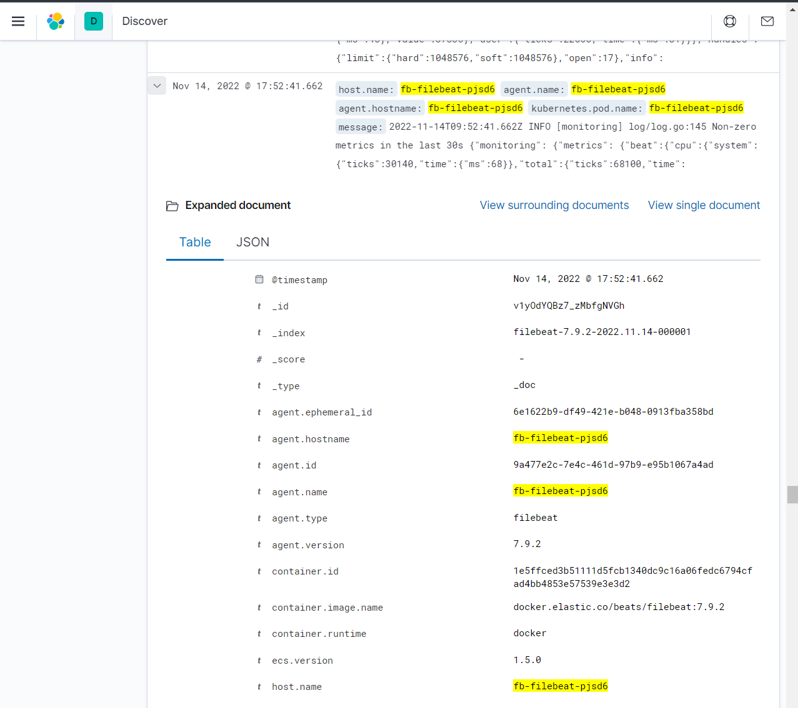


创建非云原生应用实例

```bash
nano app.yaml
```

```yaml
apiVersion: apps/v1
kind: Deployment
metadata:
  name: app
  labels:
    app: app
    env: release
spec:
  selector:
    matchLabels:
      app: app
  replicas: 1
  strategy:
    type: RollingUpdate
    rollingUpdate:
      maxUnavailable: 0
      maxSurge: 1
  # minReadySeconds: 30
  template:
    metadata:
      labels:
        app: app
    spec:
      containers:
        - name: app
          image: registry.cn-beijing.aliyuncs.com/dotbalo/alpine:3.6 
          imagePullPolicy: IfNotPresent
          volumeMounts:
          - name: logpath
            mountPath: /opt/
          env:
            - name: TZ
              value: "Asia/Shanghai"
            - name: LANG
              value: C.UTF-8
            - name: LC_ALL
              value: C.UTF-8
          command:
            - sh
            - -c
            - while true; do date >> /opt/date.log; sleep 2;  done  
      volumes: #在pod volume上存放日志
        - name: logpath
          emptyDir: {}
```

```bash
kubectl apply -f app.yaml 
```


查看pod

```bash
kubectl get pod
```


```
root@node1:~# kubectl get pod
NAME                    READY   STATUS    RESTARTS   AGE
app-68bc4f46f4-cfvr4    1/1     Running   0          5s
mysql-d869bcc87-45q9p   1/1     Running   0          7h39m
```


尝试查看pod的日志

```bash
kubectl logs app-68bc4f46f4-cfvr4
```

```
root@node1:~# kubectl logs app-68bc4f46f4-cfvr4
root@node1:~#
```

​		内容无


对比查看另外一个pod

```bash
kubectl logs mysql-d869bcc87-45q9p
```

```
2022-11-14T02:20:10.126154Z 0 [Warning] 'user' entry 'root@localhost' ignored in --skip-name-resolve mode.
2022-11-14T02:20:10.126218Z 0 [Warning] 'user' entry 'mysql.session@localhost' ignored in --skip-name-resolve mode.
2022-11-14T02:20:10.126231Z 0 [Warning] 'user' entry 'mysql.sys@localhost' ignored in --skip-name-resolve mode.
2022-11-14T02:20:10.126252Z 0 [Warning] 'db' entry 'performance_schema mysql.session@localhost' ignored in --skip-name-resolve mode.
2022-11-14T02:20:10.126256Z 0 [Warning] 'db' entry 'sys mysql.sys@localhost' ignored in --skip-name-resolve mode.
2022-11-14T02:20:10.126263Z 0 [Warning] 'proxies_priv' entry '@ root@localhost' ignored in --skip-name-resolve mode.
2022-11-14T02:20:10.128150Z 0 [Warning] 'tables_priv' entry 'user mysql.session@localhost' ignored in --skip-name-resolve mode.
2022-11-14T02:20:10.128197Z 0 [Warning] 'tables_priv' entry 'sys_config mysql.sys@localhost' ignored in --skip-name-resolve mode.
2022-11-14T02:20:10.131848Z 0 [Note] Event Scheduler: Loaded 0 events
2022-11-14T02:20:10.132107Z 0 [Note] mysqld: ready for connections.
Version: '5.7.23'  socket: '/var/run/mysqld/mysqld.sock'  port: 3306  MySQL Community Server (GPL)
2022-11-14T03:52:20.912938Z 0 [Note] InnoDB: page_cleaner: 1000ms intended loop took 332284ms. The settings might not be optimal. (flushed=0 and evicted=0, during the time.)
```

​		很丰富


给上述app注入filebeat

```bash
nano app-filebeat.yaml
```

```yaml
apiVersion: apps/v1
kind: Deployment
metadata:
  name: app
  labels:
    app: app
    env: release
spec:
  selector:
    matchLabels:
      app: app
  replicas: 1
  strategy:
    type: RollingUpdate
    rollingUpdate:
      maxUnavailable: 0
      maxSurge: 1
  # minReadySeconds: 30
  template:
    metadata:
      labels:
        app: app
    spec:
      containers:
        - name: filebeat   # sidecar容器                     
          image: registry.cn-beijing.aliyuncs.com/dotbalo/filebeat:7.10.2 
          resources:
            requests:
              memory: "100Mi"
              cpu: "10m"
            limits:
              cpu: "200m"
              memory: "300Mi"
          imagePullPolicy: IfNotPresent
          env:
            - name: podIp
              valueFrom:
                fieldRef:
                  apiVersion: v1
                  fieldPath: status.podIP
            - name: podName
              valueFrom:
                fieldRef:
                  apiVersion: v1
                  fieldPath: metadata.name
            - name: podNamespace
              valueFrom:
                fieldRef:
                  apiVersion: v1
                  fieldPath: metadata.namespace
            - name: podDeployName
              value: app
            - name: TZ
              value: "Asia/Shanghai"
          securityContext:
            runAsUser: 0
          volumeMounts:
            - name: logpath # 指向穿针引线的emptyDir
              mountPath: /data/log/app/
            - name: filebeatconf # 指向配置文件
              mountPath: /usr/share/filebeat/filebeat.yml 
              subPath: usr/share/filebeat/filebeat.yml
        - name: app
          image: registry.cn-beijing.aliyuncs.com/dotbalo/alpine:3.6 
          imagePullPolicy: IfNotPresent
          volumeMounts:
            - name: logpath
              mountPath: /opt/
          env:
            - name: TZ
              value: "Asia/Shanghai"
            - name: LANG
              value: C.UTF-8
            - name: LC_ALL
              value: C.UTF-8
          command:
            - sh
            - -c
            - while true; do date >> /opt/date.log; sleep 2;  done 
      volumes:
        - name: logpath #沟通sidecar容器和app容器的桥梁作用显现
          emptyDir: {}
        - name: filebeatconf #定义日志字段和发送目标的配置文件
          configMap:
            name: filebeatconf
            items:
              - key: filebeat.yml
                path: usr/share/filebeat/filebeat.yml
```


创建filebeat配置文件

```bash
nano  filebeat-cm.yaml
```

```yaml
apiVersion: v1
kind: ConfigMap
metadata:
  name: filebeatconf
data:
  filebeat.yml: |-
    filebeat.inputs:
    - input_type: log
      paths:
        - /data/log/*/*.log
      tail_files: true
      fields: # 日志字段
        pod_name: '${podName}'
        pod_ip: '${podIp}'
        pod_deploy_name: '${podDeployName}'
        pod_namespace: '${podNamespace}'
    output.elasticsearch:
      hosts: ["10.106.144.108:9200"] # 此处需要填充elasticsearch服务器地址
      topic: "filebeat-sidecar"
      codec.json:
        pretty: false
      keep_alive: 30s
```


```bash
kubectl apply -f filebeat-cm.yaml -f app-filebeat.yaml
```


```bash
root@node1:~# kubectl apply -f filebeat-cm.yaml -f app-filebeat.yaml
configmap/filebeatconf unchanged
deployment.apps/app configured
root@node1:~# kubectl get pod
NAME                    READY   STATUS        RESTARTS   AGE
app-68bc4f46f4-cfvr4    1/1     Terminating   0          7m46s
app-6d8c4bc6db-mtbj7    2/2     Running       0          5s
mysql-d869bcc87-45q9p   1/1     Running       0          7h47m	
```


查看pod构造


```bash
Containers:
  filebeat:
    Container ID:   docker://1f32f7d90ef53c04f932e71feb7009a4f5e5ac6b1e3bde97ac6de35ce2c215e2
    Image:          registry.cn-beijing.aliyuncs.com/dotbalo/filebeat:7.10.2
    Image ID:       docker-pullable://registry.cn-beijing.aliyuncs.com/dotbalo/filebeat@sha256:0b124b6362544e0a9b9636a187d7487c82b2865f1c3ce915b6d5dd1229ffb4a7
    Port:           <none>
    Host Port:      <none>
    State:          Running
      Started:      Mon, 14 Nov 2022 18:07:16 +0800
    Ready:          True
    Restart Count:  0
    Limits:
      cpu:     200m
      memory:  300Mi
    Requests:
      cpu:     10m
      memory:  100Mi
    Environment:
      podIp:           (v1:status.podIP)
      podName:        app-6d8c4bc6db-mtbj7 (v1:metadata.name)
      podNamespace:   default (v1:metadata.namespace)
      podDeployName:  app
      TZ:             Asia/Shanghai
    Mounts:
      /data/log/app/ from logpath (rw)
      /usr/share/filebeat/filebeat.yml from filebeatconf (rw,path="usr/share/filebeat/filebeat.yml")
      /var/run/secrets/kubernetes.io/serviceaccount from kube-api-access-7xmvt (ro)
  app:
    Container ID:  docker://b0b04fef0d22866353271751a3c350d132b40d1e6c87e36b108739674523f5fa
    Image:         registry.cn-beijing.aliyuncs.com/dotbalo/alpine:3.6
    Image ID:      docker-pullable://registry.cn-beijing.aliyuncs.com/dotbalo/alpine@sha256:36c3a913e62f77a82582eb7ce30d255f805c3d1e11d58e1f805e14d33c2bc5a5
    Port:          <none>
    Host Port:     <none>
    Command:
      sh
      -c
      while true; do echo cloudzun is here && date >> /opt/date.log; sleep 2;  done
    State:          Running
      Started:      Mon, 14 Nov 2022 18:07:17 +0800
    Ready:          True
    Restart Count:  0
    Environment:
      TZ:      Asia/Shanghai
      LANG:    C.UTF-8
      LC_ALL:  C.UTF-8
    Mounts:
      /opt/ from logpath (rw)
      /var/run/secrets/kubernetes.io/serviceaccount from kube-api-access-7xmvt (ro)

```

​		 可以观察到filebeat作为sidecare容器和app容器并置在一个pod


```bash
Events:
  Type    Reason     Age   From               Message
  ----    ------     ----  ----               -------
  Normal  Scheduled  49s   default-scheduler  Successfully assigned default/app-6d8c4bc6db-mtbj7 to node1
  Normal  Pulled     48s   kubelet            Container image "registry.cn-beijing.aliyuncs.com/dotbalo/filebeat:7.10.2" already present on machine
  Normal  Created    48s   kubelet            Created container filebeat
  Normal  Started    48s   kubelet            Started container filebeat
  Normal  Pulled     47s   kubelet            Container image "registry.cn-beijing.aliyuncs.com/dotbalo/alpine:3.6" already present on machine
  Normal  Created    47s   kubelet            Created container app
  Normal  Started    47s   kubelet            Started container app
```


到kibana查看pod日志

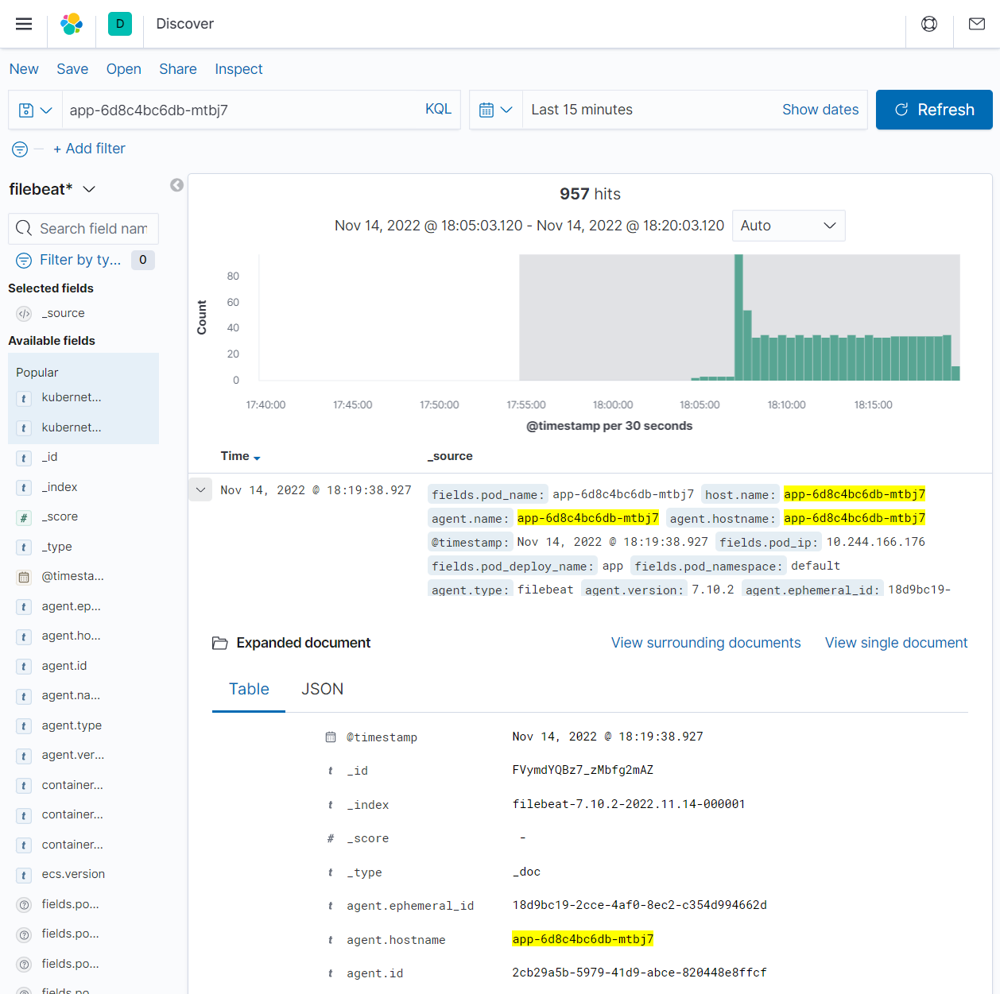


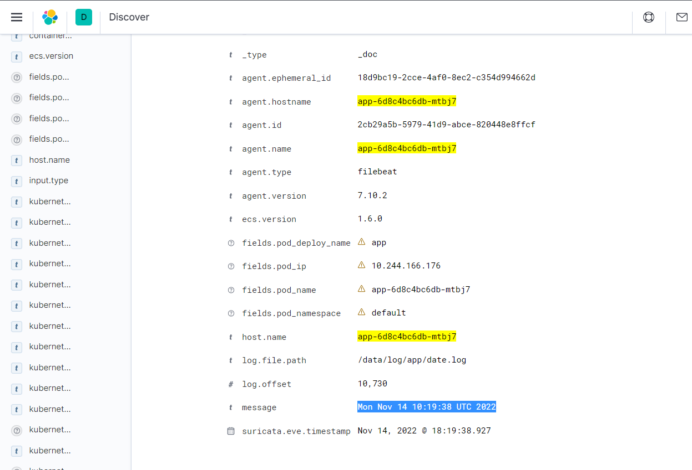


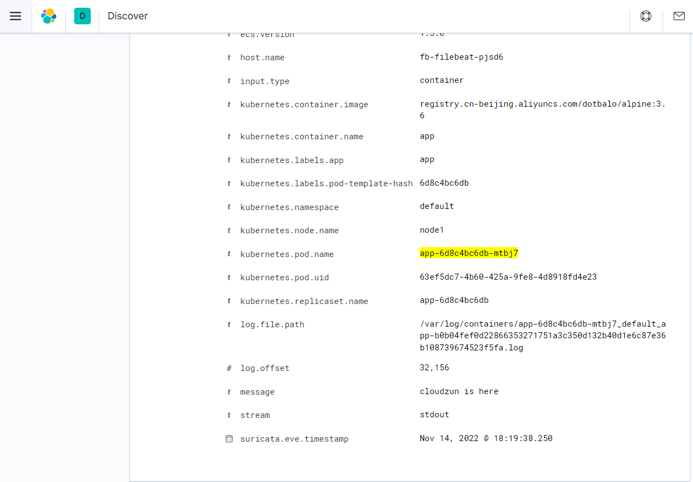


## 使用Loki构建轻量级日志收集体系


使用helm安装loki

```bash
helm repo add grafana https://grafana.github.io/helm-charts
helm repo update
helm upgrade --install loki grafana/loki-stack -n monitoring
```


检查安装情况

```bash
kubectl get pod -n monitoring | grep loki
kubectl get svc -n monitoring | grep loki
```


```bash
root@node1:~# kubectl get pod -n monitoring | grep loki
loki-0                                 1/1     Running   0          6h11m
loki-promtail-22nfd                    1/1     Running   0          6h11m
loki-promtail-6f5wl                    1/1     Running   0          6h11m
loki-promtail-957s4                    1/1     Running   0          6h11m
root@node1:~# kubectl get svc -n monitoring | grep loki
loki                    ClusterIP   10.107.108.73    <none>        3100/TCP                        6h11m
loki-headless           ClusterIP   None             <none>        3100/TCP                        6h11m
loki-memberlist         ClusterIP   None             <none>        7946/TCP                        6h11m
```


观察loki的cluster-ip


在grafana里增加loki数据源，

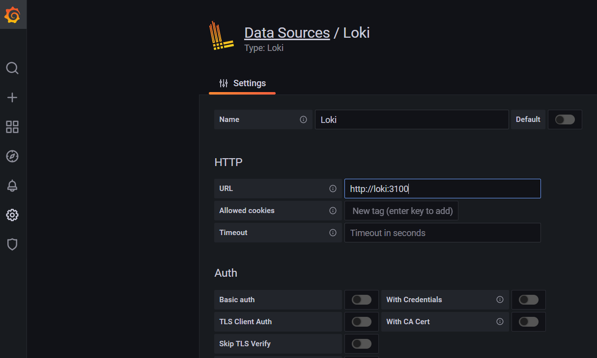

​	注意：如果loki安装在grafana之外的名称空间，则使用上述观察到的loki cluter-ip和端口）

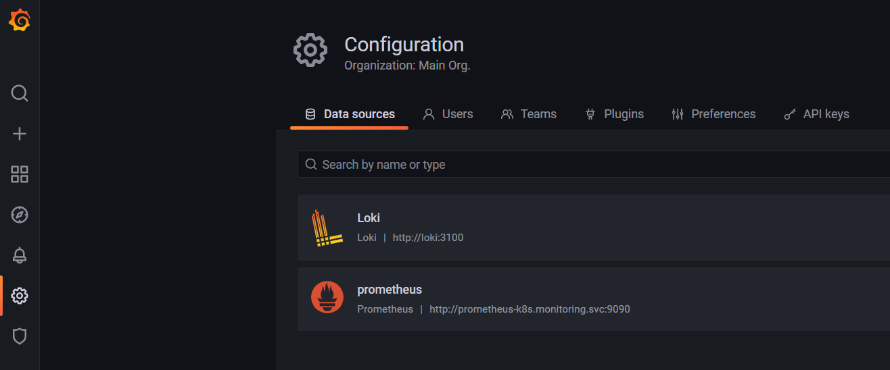


其后观察使用以下范例观察收集的日志信息

```yaml
{namespace="kube-system"}
```

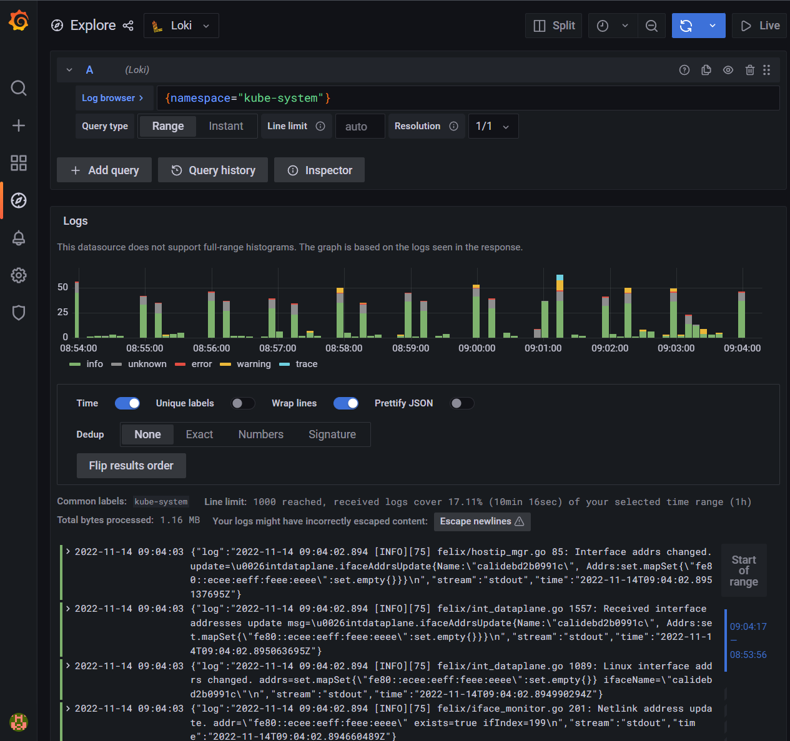


```yaml
{namespace="kube-system", pod=~"calico.*"}
```

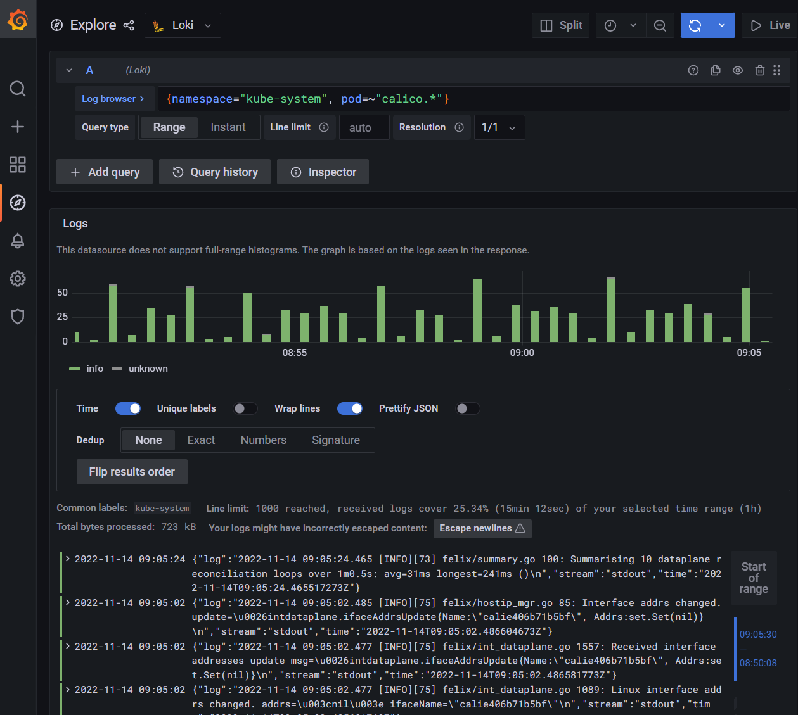


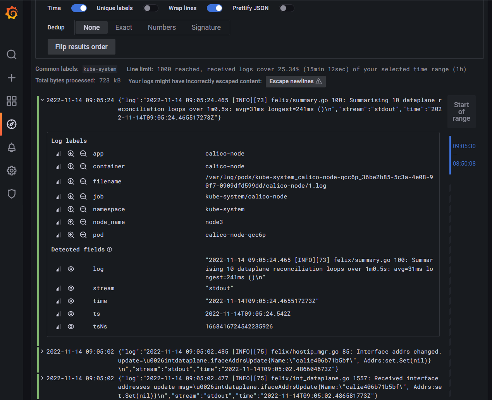


```yaml
{namespace="kube-system", pod=~"calico.*"} |~ "avg"
```

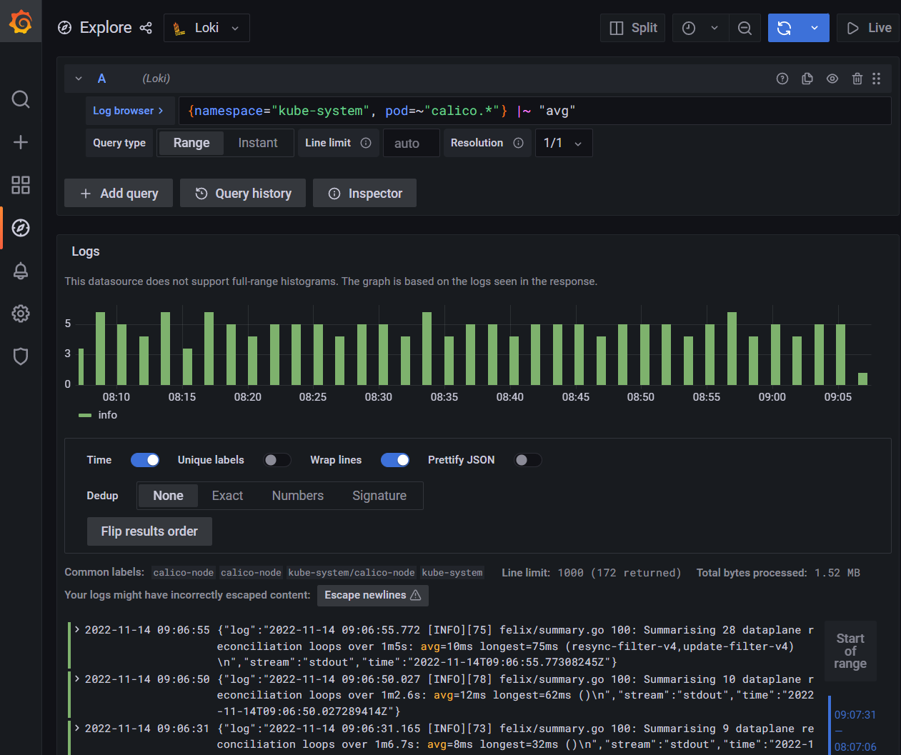


```yaml
{namespace="kube-system", pod=~"calico.*"} |~ "avg" | logfmt | longest > 16ms
```

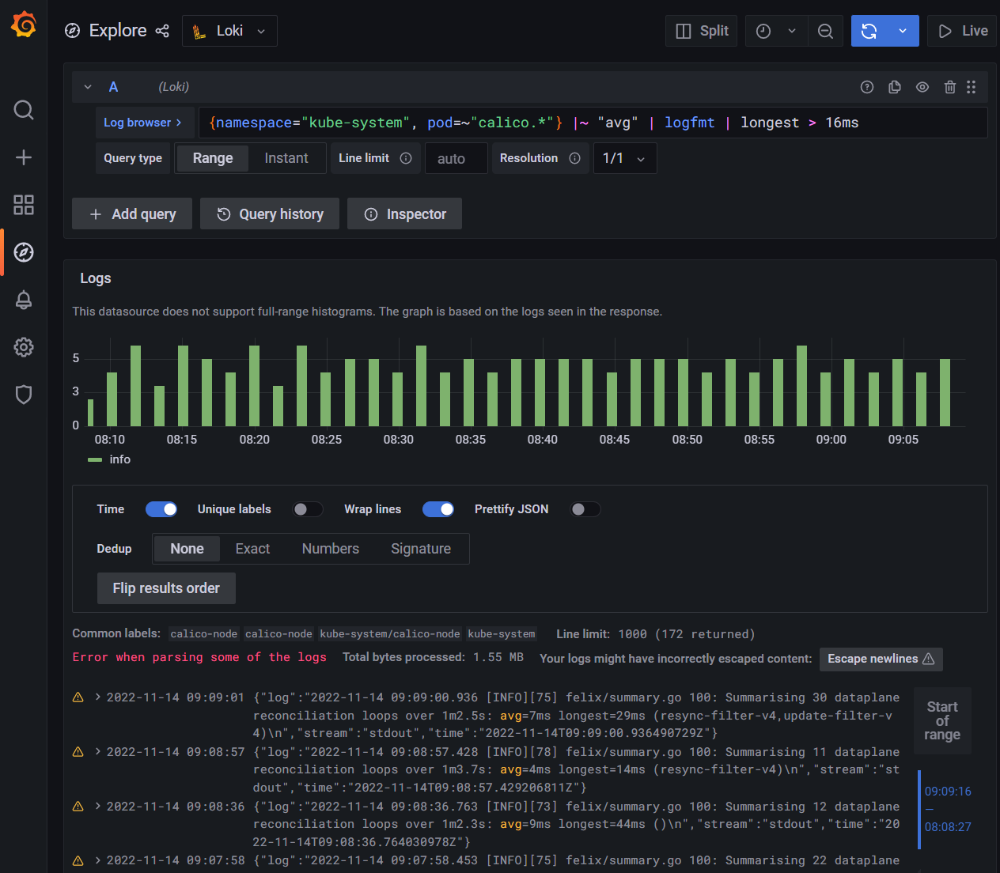


```yaml
{namespace="kube-system", pod=~"calico.*"} |~ "avg" | logfmt | longest > 16ms and avg >6ms
```

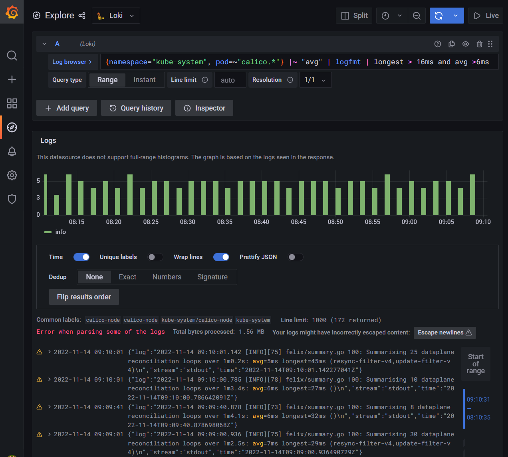


亦可在此处查看注入filebeat sidecare的pod日志

```yaml
{namespace="default", pod=~"app-6d8c4bc6db-mtbj7"}
```

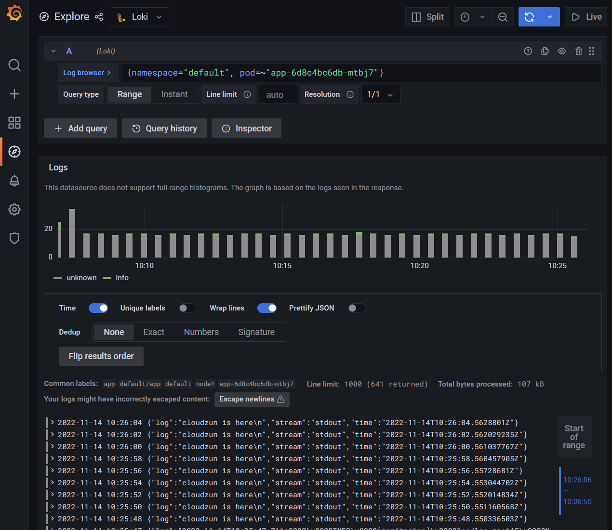


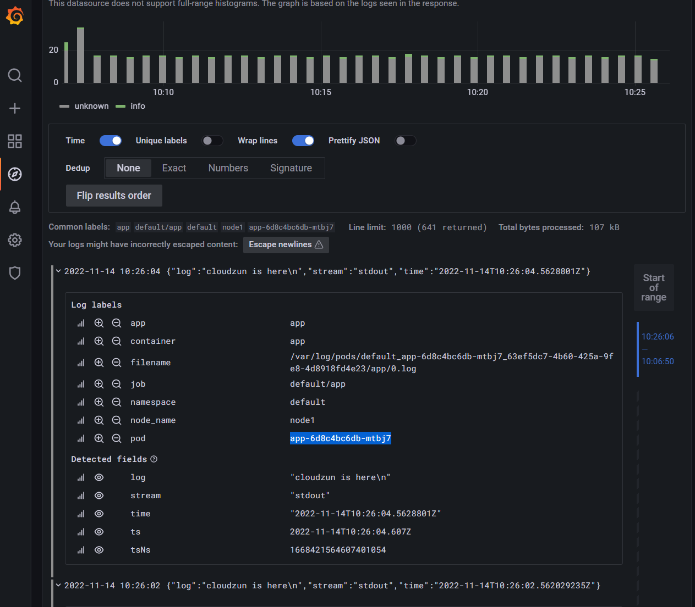